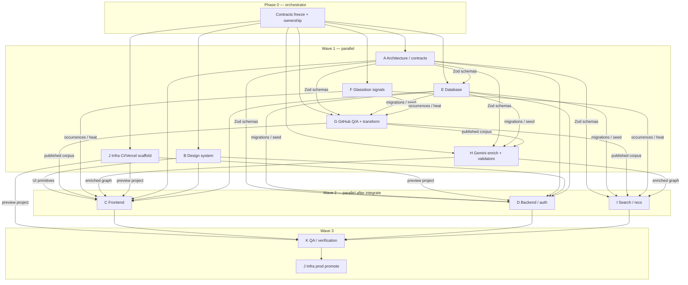

# Dependency graph

## Hard dependencies

| Consumer | Needs from |
|----------|------------|
| Database | Frozen bank + canonical entity shapes from architecture (min freeze OK to start) |
| Data-quality | Contracts; existing `src/ibpe_corpus` on main |
| Answers | Contracts + GitHub-imported answers from G (can start validators/fixtures in parallel) |
| Design system | None beyond Next/shadcn skills — can start immediately |
| Glassdoor | Nothing from product UI; AGENTS.md constraints |
| Infra | App stub path from architecture; can scaffold CI immediately |
| Frontend (W2) | DS primitives + published API stubs + auth |
| Backend (W2) | Contracts + DB + auth skill |
| Search (W2) | Published corpus + embeddings from H |
| QA (W3) | Deployable preview |

## Non-blocking rule

Never wait on Glassdoor credentials / residential proxy to stop frontend, fixtures, validators, or CI.
